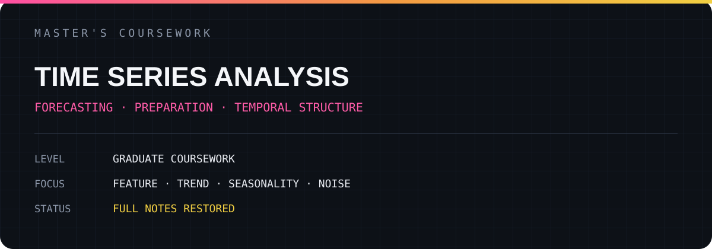

# TIME SERIES ANALYSIS

대학원 수업에서 작성한 논문 정리, 실습 기록과 모델 분석을 내용 중심으로 복원한 저장소입니다.

## Archive

- [전체 학습 기록 보기](./FULL_NOTES.md)
- 총 **15개 페이지** 수록
- 논문 핵심 내용, 수식, 코드, 실험 메모와 개인 해석 유지
- 개인 식별 정보만 제거

## Research Scope

`FEATURE` · `TREND` · `SEASONALITY` · `NOISE`

